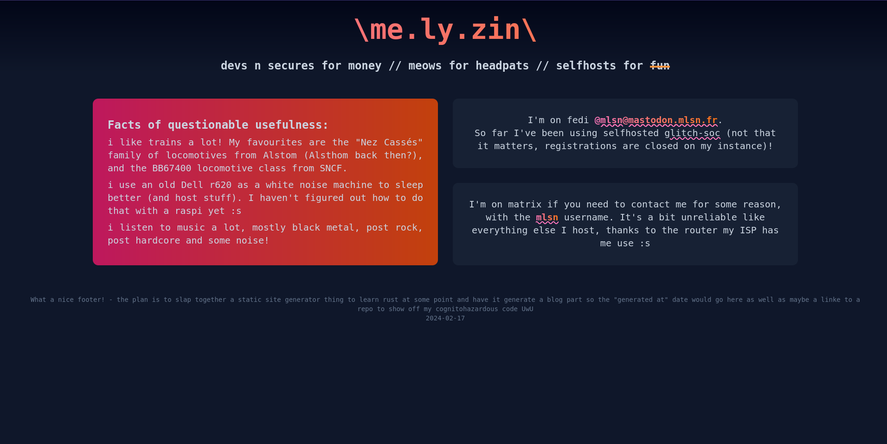
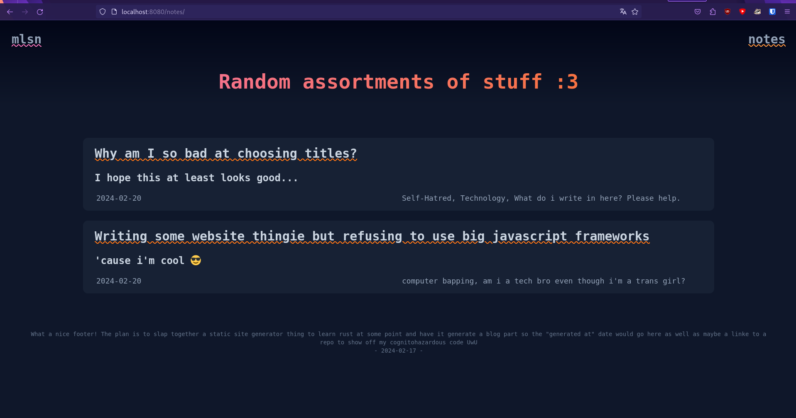
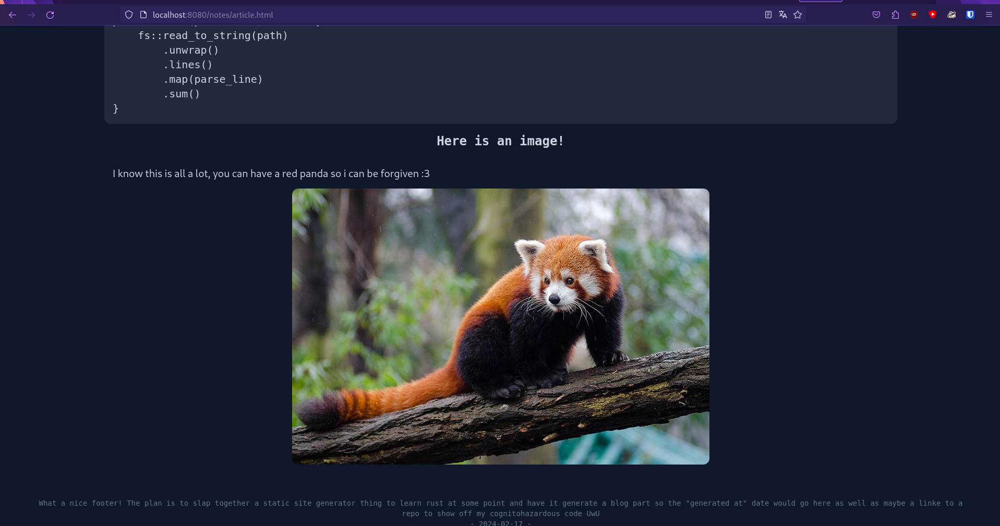
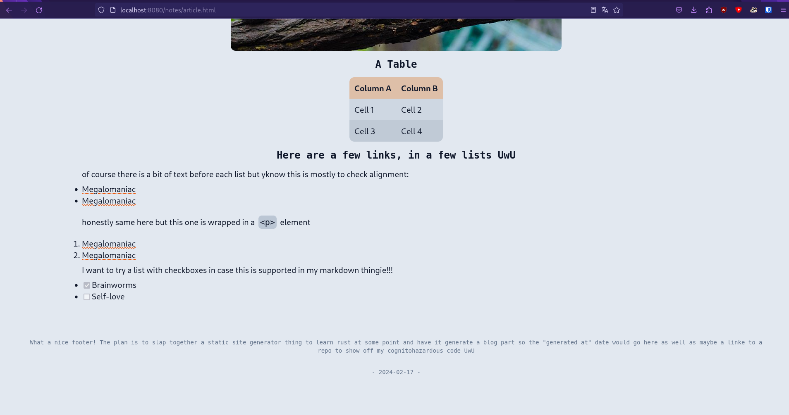

Recently I started writing stuff in rust to learn the language. I figured making a small project with it would help.
Since I also needed to check out TailwindCSS since I might need to use it, I figured making a static site generator would be fun.
The point of it is to have _something_ to put on my domain name besides the services i'm running, and having this blog-like thing would allow me to keep notes on stuff i'm doing in a fun way!

I also figured this can be the first of a series of documented weekend projects I do in my free time. Keeping notes like that kind of keeps me motivated and, most importantly, it allows me to look back at what I've done, either because I need to do something similar or as memories.

## Designing the website

The first step was to make an html + CSS prototype of the site, from which I could then make handlebars templates. I did this over a few evenings, learning tailwind as I went.

During the process, I served the contents of my source folder with python (`python -m http.server 8090 -d ./src` to serve it on port 8090, for example) and had tailwind watching for changes in another terminal. This worked well enough, although I could probably just have opened the html files in firefox directly since there is 0 javascript on the website.

Here are a few screenshots from the design process:

The main page of the website, in dark mode. It is more or less the same as what is up currently:

A prototype for the notes list page, with two random notes:

A prototype of an article page, in dark mode:

I also tried to check that light mode was fine whenever possible, here testing lists with links to the root of the page hence me calling myself a megalomaniac for linking to myself this many times (◕__◕✿):

## Writing the static site generator

Once I had the prototype to where it was tolerable enough (basically what you have now, even with tailwind I suck at css lol) I started making the static site generator proper.

It works in a few steps:
1. First, it gets all the templates that it needs from the templates folder and initializes them. This is done with the [handlebars](https://docs.rs/handlebars/latest/handlebars/) crate. It also hashes the content of the CSS file to generate the filename to put it into the HTML files.
2. then, it takes all of the notes markdown files and parses them
    - Frontmatter is parsed using the [gray_matter](https://docs.rs/gray_matter/latest/gray_matter/) crate.
    - The markdown is parsed into HTML using the [comrak](https://docs.rs/comrak/latest/comrak/) crate
        - The markdown is first parsed into an AST
        - The code iterates through all the nodes to find images and process them (takes the image source if it isn't an URL or base64, process the file to be jpg and 1920x1080 at most, put it in the staging folder and replace the old URL with the new one)
        - The AST is turned into an HTML string
        - tables are wrapped into a container div so the overflow can scroll using the `replace()` function.
3. The HTML files for the notes as well as the note cards for the list page are generated from the templates with the parsed information
4. The HTML files for the list page and the main page are generated using the templates
5. The CSS is generated using tailwind (this needs to happen last, because it takes info on which class is used from the generated HTML)
6. The site is ready to be deployed (hopefully)

## Conclusion?

Overall, this was a fun project! It helped me get acquainted with tailwind and more familiar with rust, and it was a nice change of pace from using advent of code problems to learn the language. I'm mostly hyped about having a cool place to have my notes up on stuff so I can share them with people if needed (as if lol).

Currently, the code is a massive mess, since I am super new to rust and didn't do much actual reading before throwing myself at projects.
The plan is to change that by reading the official book at some point.
I might go back to it to try and clean this up once that is done.

In the mean time, if you know rust and want to hurt your brain, the code is on my [github](https://github.com/melsincostan/ssg). I am sorry.